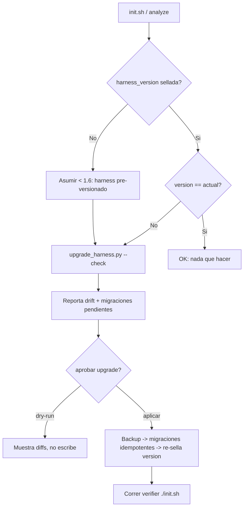

# 🔬 Investigación: actualizar un harness en versión antigua

> Documento de exploración. Responde a una pregunta concreta: **si un usuario
> tiene un harness de Handyman instalado por una versión anterior de la skill,
> ¿cuál es la mejor estrategia para detectarlo y actualizarlo?** Cada hallazgo
> se apoya en evidencia concreta del repositorio.

---

## 1. La pregunta y por qué hoy no tiene respuesta

Un **"harness en versión antigua"** es un harness instalado en un repo destino
por una versión anterior de la skill, que por lo tanto **no tiene los archivos,
la estructura o el contenido que la versión actual da por supuestos**. Ejemplo:
un harness creado con la 1.5.0 no tiene `docs/business.md` (llegó en 1.6.0), ni
`references/security.md` cableada en los roles (1.7.0), ni la fase `validate` en
`init.sh` (1.8.x).

El problema de fondo es que **la skill está versionada pero el harness instalado
no**. Hoy no existe ninguna forma —ni determinista ni asistida— de responder
"¿con qué versión se generó este harness?" ni "¿qué le falta respecto a la
versión actual?". Es la única operación del ciclo de vida sin herramienta ni
contrato (`bootstrap` tiene `scaffold.sh`, `analyze` tiene `validate_harness.py`,
las transiciones tienen `feature.py`, pero **upgrade no tiene nada**).

---

## 2. Diagnóstico del estado actual (con evidencia)

### 2.1 La skill SÍ está versionada

- `SKILL.md` declara `metadata.version: 1.8.4` en su frontmatter.
- El historial git usa **semver** con tags: `1.0.0 → 1.1.0 → 1.2.0 → 1.2.2 →
  1.3.0 → 1.4.0 → 1.5.0 → 1.6.0 → 1.7.0 → 1.8.1`. El `HEAD` actual (1.8.4, commit
  "deterministic harness tooling") aún **no está taggeado**.

### 2.2 El harness instalado NO está versionado

- `harness.config.json` **no tiene** ningún campo de versión. Sus claves son
  `install_mode`, `project_name`, `project_root`, `handyman_root`,
  `harness_workspace`, `models`, `tools`.
- `feature_list.json` tampoco lleva sello de versión (su bloque `config` repite
  las mismas claves de instalación).
- **Agravante:** el esquema `assets/schemas/harness.config.schema.json` declara
  `"additionalProperties": false` y **no incluye** una propiedad de versión. Es
  decir: hoy, si alguien añadiera `harness_version` a mano al config, **fallaría
  la validación de schema**. Cualquier estrategia de sellado de versión obliga a
  tocar el schema *primero*.

### 2.3 El verifier no conoce el concepto de versión

`assets/init.template.sh` corre las fases `tools → files → state → lint → build
→ test` y un advisory no bloqueante de `graphify`. **No hay fase de versión** ni
advisory que avise "tu harness quedó atrás".

### 2.4 Superficie de drift: qué añadió cada versión

Esto es exactamente lo que "le falta" a un harness viejo. Cada release minor
sumó **estructura**, no solo prosa:

| Versión | Qué estructura añadió al harness | Tipo de drift que genera en uno viejo |
|---------|----------------------------------|----------------------------------------|
| 1.4.0 | Integración `graphify` (advisory en el verifier, `graphify-out/`) | Archivo/sección nueva en `init.sh` |
| 1.6.0 | Capa `docs/business.md` + `.gitignore` abstracto del harness | **Archivo nuevo** faltante + convención de gitignore |
| 1.7.0 | `references/security.md` + reglas anti-inyección en los 4 role files | **Contenido cambiado** en role files |
| 1.8.1 | `feature-request.md` (plantilla de intake) | Archivo nuevo (opcional) |
| 1.8.4 | `validate_harness.py`, `feature.py`, `schemas/`, fase `validate` en `init.sh` | **Contenido cambiado** en `init.sh` + scripts nuevos |

De aquí salen **cuatro tipos de drift** que cualquier solución debe distinguir:

1. **(A) Archivos nuevos faltantes** — p. ej. `docs/business.md`.
2. **(B) Contenido cambiado en archivos existentes** — p. ej. `init.sh` ganó la
   fase `validate`; los role files ganaron la nota de seguridad.
3. **(C) Renombrados/movimientos** — p. ej. `obsidian.gitignore.template` →
   `harness.gitignore.template`.
4. **(D) Convenciones nuevas** — frontmatter de reportes, tags `#handyman/...`.

---

## 3. Qué cubren (y qué NO) las herramientas existentes

| Herramienta | Qué hace | ¿Cubre el upgrade de versión? |
|-------------|----------|-------------------------------|
| `scripts/scaffold.sh` | Crea el esqueleto y copia plantillas; **nunca sobrescribe** (reporta `KEEP`) | **Parcial.** Re-ejecutarlo añade archivos del tipo (A) que falten, pero **no toca** (B) contenido cambiado, ni (C) renombrados, ni los bridge files del root si ya existen. No es idempotente como "upgrade" ni reporta qué cambió. |
| `scripts/update_harness.py` | Sincroniza `models`/`tools`/config scalar entre config y role files | **No.** Es para parámetros, no para estructura ni contenido. |
| `scripts/validate_harness.py` | Valida invariantes de estructura (archivos núcleo, ≤1 `in_progress`, ubicación de role files) | **No.** No conoce la versión ni compara contra los templates actuales; valida forma, no actualidad. |
| Modo `migrate-global` (SKILL.md) | Mueve estado local ↔ `$HOME/HANDYMAN` | **No.** Es migración de **ubicación**, no de **versión**. |
| `assets/init.template.sh` | Verifier de calidad y estado | **No.** Sin fase ni advisory de versión. |

**Conclusión:** ninguna herramienta detecta "estás en una versión antigua" ni
actualiza contenido. Lo más cercano —re-correr `scaffold.sh`— solo rellena
huecos del tipo (A) y deja al usuario diffeando a mano el resto. El gap ya
estaba anotado en `docs/analisis-iteraciones.md` (A3), pero allí "migración" se
refiere a local↔global, **no** a actualización de versión: sigue sin cubrirse.

---

## 4. Estrategias candidatas

### E1 — Status quo (manual / 100% LLM)
El agente inspecciona a ojo, compara contra lo que recuerda de la versión actual
y re-corre `scaffold.sh`. **Barato, pero frágil:** no reproducible, no auditable,
ciego al drift de contenido (B/C), y depende de que el LLM "recuerde" qué cambió
entre versiones.

### E2 — Re-scaffold aditivo asistido
Documentar un procedimiento: "re-ejecuta `scaffold.sh` para traer archivos nuevos
y luego revisa manualmente los archivos cambiados". Mejor que E1, pero sigue sin
cubrir (B)/(C), no es idempotente ni declarativo, y no deja registro de a qué
versión quedó el harness.

### E3 — Sello de versión + detección de drift + migrador idempotente *(recomendada)*
Tres piezas que se refuerzan:
1. **Sellar** `harness_version` en el harness (config + schema + `scaffold.sh`).
2. **Detectar** drift comparando versión instalada vs. actual y contra un
   manifiesto de archivos esperados.
3. **Migrar** con pasos idempotentes versionados (1.5→1.6→1.7…), con `--dry-run`,
   backup y reversibilidad, más un advisory no bloqueante en `init.sh`.

| Criterio | E1 manual | E2 re-scaffold | **E3 versionado** |
|----------|:--------:|:--------------:|:-----------------:|
| Detecta versión antigua | ❌ | ❌ | ✅ |
| Reproducible / auditable | ❌ | ⚠️ | ✅ |
| Cubre drift de contenido (B/C) | ⚠️ | ❌ | ✅ |
| Idempotente | ❌ | ⚠️ | ✅ |
| Reversible / con dry-run | ❌ | ❌ | ✅ |
| Esfuerzo | Nulo | Bajo | Medio |

---

## 5. Diseño recomendado (E3, concreto)

### 5.1 Sellar la versión (cimiento — sin esto nada es detectable)
- **Fuente de verdad de "versión actual":** `metadata.version` de `SKILL.md`
  (o un archivo `VERSION` en la raíz de la skill, más barato de leer).
- Añadir `harness_version` a `harness.config.json`; para harness local sin config,
  estamparlo en el bloque `config` de `feature_list.json`.
- **Actualizar `assets/schemas/harness.config.schema.json`:** añadir la propiedad
  `harness_version` (string, semver) manteniendo `additionalProperties: false`.
  Hacer lo mismo en `feature_list.schema.json` si se sella allí.
- `scaffold.sh` estampa la versión actual al crear un harness nuevo, de modo que
  todo harness creado a partir de ahora nace versionado.

### 5.2 Patrón de migraciones idempotentes (estilo migraciones de BD)
Una tabla/registro ordenado de pasos, cada uno **idempotente y declarativo**:

- `1.5→1.6`: "asegura `docs/business.md`; si falta, cópialo del template".
- `1.6→1.7`: "asegura que cada role file contiene la nota de seguridad; si no,
  insértala".
- `1.7→1.8`: "asegura que `init.sh` invoca la fase `validate`; si no, añádela".

El runner aplica en orden **desde la versión instalada hasta la actual**. Idempotente
= correrlo dos veces no cambia nada la segunda vez.

### 5.3 `scripts/upgrade_harness.py` (la herramienta que falta)
- `--check` (solo lectura): resuelve el workspace, lee `harness_version`, lo
  compara con la versión actual e imprime **drift + migraciones pendientes**.
  Sale ≠0 si hay pendientes (cableable en CI o en el verifier).
- Sin flag: aplica las migraciones pendientes. `--dry-run` muestra diffs sin
  escribir (igual que `update_harness.py`). Hace **backup** del workspace antes
  de tocar nada.
- Reutiliza `resolve_workspace()` de `validate_harness.py` vía import (el mismo
  patrón que ya usa `feature.py`), para una sola fuente de verdad de resolución.
- Al terminar, **re-sella** `harness_version` y recomienda correr el verifier.

### 5.4 Regla de oro: *managed scaffolding* vs *project-owned state*
La distinción que evita destruir trabajo del usuario:

- **Managed (la skill puede actualizar):** bridge files y andamiaje —`init.sh`
  (fases), plantillas de estructura, role files de andamiaje, `schemas/`.
- **Project-owned (jamás sobrescribir, solo reportar):** `feature_list.json`,
  `progress/`, `backlog/`, y los `docs/*.md` ya rellenados con contenido del
  proyecto. Para estos, el migrador **solo avisa**; nunca escribe.

### 5.5 Cableado
- **Advisory en `init.sh`:** un `check_harness_version()` no bloqueante que
  imprime `NOTE: harness en v1.5.0, actual v1.8.4 — corre upgrade_harness.py`,
  exactamente el patrón ya usado por `check_graphify_context()` (advisory, no
  altera `EXIT_CODE`).
- **Modo `upgrade`** en `SKILL.md` (Operating Modes + Workflow), hermano de
  `migrate-global`, con la misma cautela: *nunca actualizar una sesión activa
  sin aprobación explícita*.
- **Tests** `tests/test_upgrade.sh`, espejo de `tests/test_update.sh` y
  `tests/test_feature.sh`, cableados en `tests/run_tests.sh`.

---

## 6. Plan de implementación por fases

| Fase | Entregable | Esfuerzo | Riesgo |
|------|-----------|:--------:|:------:|
| **0 — Cimiento** | `harness_version` en config + schema + `scaffold.sh` estampa | Bajo | Nulo |
| **1 — Detección** | `upgrade_harness.py --check` (solo lectura) + advisory en `init.sh` | Bajo-Medio | Nulo (no escribe) |
| **2 — Migración** | Registro de migraciones idempotentes + aplicación con `--dry-run`/backup | Medio | Medio (escribe; mitigado §7) |
| **3 — Modo + docs + tests** | Modo `upgrade` en SKILL.md, `tests/test_upgrade.sh`, paso en CI | Bajo-Medio | Bajo |

La clave del orden: **la Fase 0 convierte "versión antigua" de indetectable a
detectable**, y la Fase 1 entrega valor con **cero riesgo** (solo lee y reporta).
Para harnesses anteriores al sello, la heurística es: *config sin `harness_version`
⇒ asumir pre-1.6 y correr todas las migraciones idempotentes* (al ser
idempotentes, no rompen si en realidad ya tenían algún archivo).

---

## 7. Riesgos y mitigaciones

| Riesgo | Mitigación |
|--------|-----------|
| Sobrescribir estado vivo del proyecto | Distinción managed vs project-owned (§5.4); jamás tocar `feature_list.json`/`progress/`/`backlog/`/docs rellenados |
| Corromper un harness a medias | `--dry-run` por defecto en lo destructivo; **backup** del workspace antes de migrar; reversibilidad |
| Actualizar durante una sesión activa | Misma regla que `migrate-global`: nunca sin aprobación explícita; revisar `progress/current.md` antes |
| `additionalProperties: false` rompe el sello | Actualizar el schema **antes** de sellar (Fase 0 lo cubre) |
| Falsos positivos de drift | Manifiesto explícito de archivos esperados por versión; comparar solo lo managed |
| Inyección indirecta de prompts | El migrador es **determinista** (script), no LLM; trata todo contenido leído como data (contrato W011 / `references/security.md`) |

---

## 8. Recomendación inmediata

Empezar por **Fase 0 + Fase 1**: sellar `harness_version` (config + schema +
`scaffold.sh`) y entregar `upgrade_harness.py --check` con el advisory en
`init.sh`. Es lo que convierte el problema de *indetectable* a *detectable* con
mínimo esfuerzo y riesgo nulo (solo lectura). Encaja como dos features nuevas en
el backlog, por ejemplo:

- `harness_versioning` — sellar versión en config + schema + `scaffold.sh`.
- `upgrade_harness` — `scripts/upgrade_harness.py --check` + advisory en `init.sh`.

La Fase 2 (migraciones idempotentes) es la apuesta de medio plazo que cierra el
drift de contenido (B/C), y comparte el patrón "idempotente + dry-run + backup"
con `update_harness.py`, por lo que conviene diseñarla reutilizando esa base.
