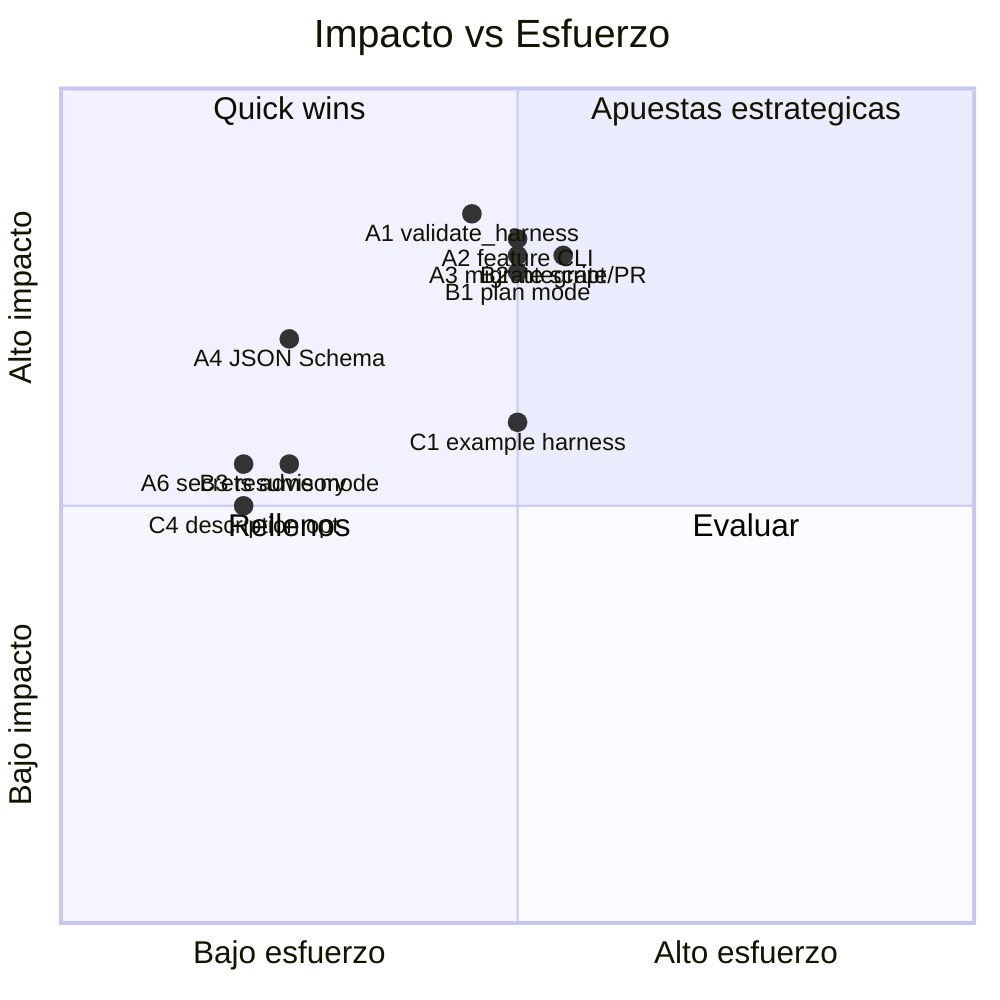

# 🔬 Análisis investigativo: próximas iteraciones de Handyman

> Documento de exploración. Revisa el formato actual de la skill y propone
> nuevas **herramientas**, **etapas** y **mejoras** sobre las que iterar.
> Cada hallazgo se apoya en evidencia concreta del repositorio.

---

## 1. Cómo está hecho hoy (revisión de formato)

Handyman está construida como una **skill con divulgación progresiva** (progressive disclosure), un patrón sólido y bien ejecutado:

| Capa | Qué contiene | Costo de contexto |
|------|--------------|-------------------|
| `description` (frontmatter) | Disparadores de activación | En toda conversación |
| `SKILL.md` (~1.000 palabras) | Reglas núcleo, modos, workflow resumido | Por activación |
| `references/*.md` (10 archivos) | Anatomía, workflow, modelos, tools, seguridad, graphify, Obsidian, etc. | Bajo demanda |
| `assets/*.template.*` | Plantillas deterministas para el bootstrap | Solo al copiarse |
| `scripts/` | Automatización determinista (`scaffold.sh`, `update_harness.py`) | Ejecución, sin tokens |

**Estado de madurez (alto):**

- ✅ **Cinco modos** claros: `analyze`, `bootstrap` (local/global), `run-feature`, `review`, `migrate-global`.
- ✅ **Cuatro roles** con modelo y tools por rol (menor privilegio): leader, implementer, reviewer, explorer.
- ✅ **Tooling determinista** para crear (`scaffold.sh`) y actualizar (`update_harness.py`) harnesses, más un verificador (`init.template.sh`).
- ✅ **Capa de contexto** opcional vía graphify, integrada como advisory no bloqueante en el verifier.
- ✅ **Calidad cableada**: `tests/run_tests.sh` (estructura de docs + verifier + updater), CI con `tests` + `shellcheck`, y `evals/trigger-eval.json` con 20 queries para activación.
- ✅ **Presupuestos de tokens** protegidos por test (`test_token_budgets`: caps 1000/500/250).
- ✅ **Contrato de seguridad** explícito contra inyección indirecta de prompts (`references/security.md`, mitigación W011).

**Observaciones de formato (menores):**

- El `README.md` está en español mientras `references/` y `assets/` están en inglés. Para una skill open-source conviene decidir un idioma canónico (o documentar la dualidad) para no friccionar a contribuidores.
- `analyze` es **100% dependiente del LLM**: no hay un validador ejecutable de estructura, pese a que `references/anatomy.md` ya lo anuncia como archivo de soporte (ver A1).
- La **migración** —la operación que mueve estado mutable, la más riesgosa— es la única sin herramienta determinista (ver A3).

---

## 2. Oportunidades por eje

Cada hallazgo declara **qué**, **evidencia** en el repo, e **impacto/esfuerzo**.

### 🔧 Eje A — Nuevas herramientas (automatización determinista)

#### A1. `scripts/validate_harness.py` — validador de estructura
- **Qué:** convertir el *Analysis Checklist* en un chequeo determinista y testeable: resolver `HARNESS_WORKSPACE`, verificar archivos núcleo, parsear `feature_list.json`, exigir ≤1 `in_progress`, confirmar que los role files viven en la ruta de plataforma, y que los links de docs resuelven.
- **Evidencia:** `references/anatomy.md` ya lo lista en *Optional Support Files* (`scripts/validate_harness.*`), pero **no existe**: `scripts/` solo tiene `scaffold.sh` y `update_harness.py`. Hoy `analyze` no tiene piso reproducible.
- **Impacto/esfuerzo:** Alto / Medio. Se puede cablear en `init.sh` y en `tests/`, y vuelve `analyze` auditable.

#### A2. CLI de gestión de `feature_list.json` (transiciones de estado)
- **Qué:** `scripts/feature.py` con operaciones atómicas `add | start | block | done`, forzando el grafo de estados (`pending → in_progress → done`) y la invariante de **un solo `in_progress`**; al cerrar, hace append a `progress/history.md` y resetea `progress/current.md`.
- **Evidencia:** hoy los agentes **editan el JSON a mano**, que es exactamente el origen de los riesgos que `references/checklists.md` ya enumera: *Split scope*, dos features `in_progress`, *History drift*.
- **Impacto/esfuerzo:** Alto / Medio. Elimina una clase entera de errores de estado.

#### A3. `scripts/migrate.(sh|py)` — migración local ↔ global determinista
- **Qué:** mover `feature_list.json`, `progress/`, `backlog/`, `docs/`; escribir `harness.config.json`; repointar bridges (`AGENTS.md`, `CHECKPOINTS.md`, role files, `init.sh`). Con `--dry-run` y reversibilidad.
- **Evidencia:** `bootstrap` tiene `scaffold.sh`, pero `migrate-global` es **100% LLM** pese a ser la operación más delicada (mueve estado vivo). El propio workflow advierte "never migrate an active session without explicit approval".
- **Impacto/esfuerzo:** Alto / Medio. Cierra la última brecha de determinismo entre modos.

#### A4. JSON Schema para `feature_list.json` y `harness.config.json`
- **Qué:** esquemas formales que validen el *contrato* (no solo que el JSON parsee): `valid_status`, forma de `features`, `config`, mapas `models`/`tools`, ≤1 `in_progress`.
- **Evidencia:** `tests/test_docs.py` T1 solo comprueba que los `*.template.json` parsean; la invariante de un solo `in_progress` vive **únicamente** en `init.sh` (bash + jq). Un schema sirve en editor, CI y verifier.
- **Impacto/esfuerzo:** Medio-Alto / Bajo.

#### A5. Generador de reportes con frontmatter (`scripts/new_report.py`)
- **Qué:** emitir el esqueleto de `impl_<feature>.md`, `review_<feature>.md` o `explore_<topic>.md` con frontmatter, tags `#handyman/...` y fecha correctos.
- **Evidencia:** existen `assets/backlog-impl.template.md` y `assets/backlog-review.template.md`, pero `scaffold.sh` **no los instancia** y ninguna herramienta los materializa: cada agente reconstruye el contrato Obsidian a mano (riesgo de drift de frontmatter/tags).
- **Impacto/esfuerzo:** Medio / Bajo.

#### A6. Advisory de secretos en `init.sh`
- **Qué:** chequeo no bloqueante que haga `grep` de patrones sensibles (`.env`, claves, tokens) dentro de `backlog/` y avise si un reporte filtró un secreto.
- **Evidencia:** `references/security.md` exige "keep secrets out of `backlog/` reports", pero **nada lo verifica**. Coherente con la mitigación W011 y con el patrón advisory de graphify ya presente en el verifier.
- **Impacto/esfuerzo:** Medio / Bajo.

#### A7. Auto-oferta del hook de graphify en bootstrap
- **Qué:** que `scaffold.sh` ofrezca `graphify hook install` al final, en vez de dejarlo como paso manual.
- **Evidencia:** `references/graphify.md` documenta el hook como recomendado, pero el bootstrap no lo toca.
- **Impacto/esfuerzo:** Bajo / Bajo.

### 🪜 Eje B — Nuevas etapas / modos del flujo

#### B1. Modo `plan` (decompose) — de intake a backlog
- **Qué:** convertir `feature-request.md` (o un objetivo grande) en **varias** entradas de `feature_list.json` con `acceptance` por feature.
- **Evidencia:** existe `assets/feature-request.template.md`, pero **ningún modo lo consume**: la creación de features está implícita en el *Leader Protocol* #4. Una etapa de planificación cierra el hueco intake → backlog.
- **Impacto/esfuerzo:** Alto / Medio.

#### B2. Etapa `integrate` (cierre → PR de git)
- **Qué:** tras cerrar una feature, crear rama/commit/PR con el detalle de cambios.
- **Evidencia:** el cierre termina en `progress/history.md` y **nada conecta con git/PR**, aunque el entorno ya tiene skills de pull-request y existe `docs/pull_request_detail.md`. Cerrar el loop feature → PR es el siguiente eslabón natural.
- **Impacto/esfuerzo:** Alto / Medio.

#### B3. Modo `resume` (handoff explícito)
- **Qué:** reconstruir contexto desde `progress/current.md` + `backlog/` tras una interrupción, como modo de primera clase.
- **Evidencia:** el *Startup Protocol* ya hace esto (pasos 5–8) pero no es invocable por nombre; "retomar sesiones interrumpidas" es un objetivo declarado del README, así que merece ser un modo explícito.
- **Impacto/esfuerzo:** Medio / Bajo.

#### B4. Modo `report` / retrospectiva
- **Qué:** resumen a través de features cerradas (qué se hizo, drift, ritmo) leyendo `progress/history.md` y `feature_list.json`; útil para standup humano.
- **Evidencia:** hay historia append-only pero ninguna vista agregada sobre ella.
- **Impacto/esfuerzo:** Medio / Bajo-Medio.

#### B5. Modo `triage` / priorización
- **Qué:** reordenar el backlog por dependencia o prioridad.
- **Evidencia:** la única política hoy es "lowest-id `pending`" (anatomy.md / workflow.md). En backlogs grandes hace falta más.
- **Impacto/esfuerzo:** Bajo-Medio / Medio.

### 🛠️ Eje C — Mejoras al proyecto / formato

| # | Mejora | Evidencia | Impacto/Esfuerzo |
|---|--------|-----------|------------------|
| C1 | **Harness de ejemplo ejecutable** (`example/`): un mini-repo real (p. ej. `notes-cli` con `.handyman/` completo) que sirva de documentación viva **y** fixture de tests para `analyze`/`review`. | `references/examples.md` es prosa; el único fixture es `tests/fixtures/init.reference.sh`. | Medio / Medio |
| C2 | **Verifier portable en Python** (sin `jq`/bash) como alternativa. | `init.template.sh` falla si falta `jq`; limita Windows y contenedores mínimos. | Medio / Medio |
| C3 | **Decisión de idioma** canónico (EN) + traducción, o nota explícita. | README en español vs `references/`/`assets/` en inglés. | Medio / Bajo |
| C4 | **Optimizar la `description`** y medir activación con el loop del skill-creator. | `evals/trigger-eval.json` ya tiene 20 queries listas; la description está cerca del cap de 500 chars y "keyword-stuffed". | Medio / Bajo |
| C5 | **Métricas de costo/tiempo** por rol/feature (estilo `timing.json`). | `references/models.md` justifica modelos por costo, pero nada lo mide. | Medio / Medio |
| C6 | **Subir la invariante de estado a los tests** de la skill (o al schema A4): ≤1 `in_progress` hoy solo se valida en bash/jq. | `tests/test_docs.py` no cubre el contrato de `feature_list`. | Medio / Bajo |
| C7 | **Cobertura de plataformas de role files** (Cursor, Windsurf, Aider…) con tabla de mapeo. | Hoy solo `.github/agents/` y `.claude/agents/`. | Bajo-Medio / Medio |

---

## 3. Roadmap priorizado

**Secuencia sugerida:**

1. **Quick wins (bajo esfuerzo, valor inmediato):** `A4` (JSON Schema) → `A6` (advisory de secretos) → `C4` (optimizar `description`, ya hay evals) → `A1` (validate_harness, también testeable).
2. **Apuestas de medio plazo:** `A2` (feature CLI) y `A3` (migrate script) eliminan las dos clases de riesgo de estado; `B1` (plan) y `C1` (example harness) refuerzan entrada y documentación.
3. **Estratégicas:** `B2` (integrate/PR) conecta Handyman con git; `C5` (métricas) cierra el rationale de costo de los modelos por rol; `B4` (report) da visibilidad humana.

---

## 4. Recomendación para la próxima iteración

Empezar por **A1 `validate_harness.py`**: es la pieza con mejor relación impacto/esfuerzo porque (a) ya está prometida en `references/anatomy.md`, (b) vuelve `analyze` determinista y auditable, (c) se cablea de inmediato en `init.sh` y `tests/`, y (d) habilita el harness de ejemplo (`C1`) como fixture. Acto seguido, **A4 (schema)** y **A2 (feature CLI)** comparten lógica de contrato con el validador, por lo que conviene diseñarlos juntos para reutilizar la validación de `feature_list.json` en una sola fuente de verdad.
