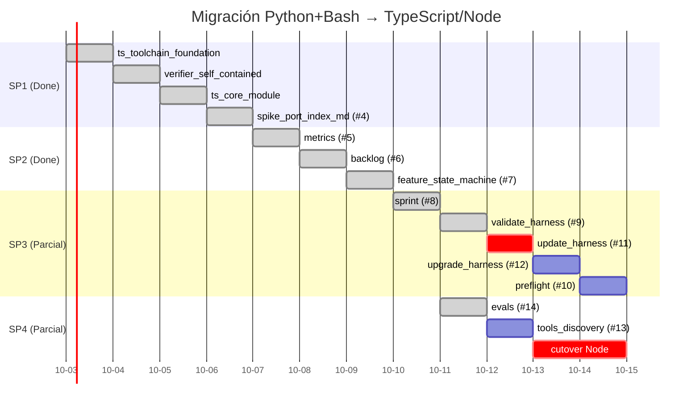

# 📊 Estado de la migración: Python + Bash → TypeScript sobre Node

> Snapshot verificado del avance de la migración (strangler fig) de la skill
> Handyman de Python + Bash a TypeScript ejecutado sobre Node. Este documento
> refleja el estado **real** del repositorio al **2026-07-16** (rama de
> integración `feat/migration-to-node-bun` @ `c1bec96`, PR #24 abierto).
>
> Registra qué CLIs ya viven en `handyman/src/`, cuáles siguen en
> `handyman/scripts/` como Python, y el orden recomendado para cerrar la deuda.
> Fuente de datos viva del harness: `.handyman/feature_list.json` y
> `.handyman/docs/current/handoff-2026-07-16.md`.

---

## 1. Estrategia (no cambió)

Migración por **strangler fig**: un script Python→TS a la vez, con **oráculo de
paridad** = las suites black-box en bash (`tests/test_*.sh`) apuntadas a
`node dist/x.js` **sin editar aserciones**. Cada port deja:

- Un gemelo `handyman/src/x.ts` apoyado en el `core` compartido.
- El oráculo repuntado a `node dist/x.js` (cambio de una línea, 0 aserciones).
- Paridad byte-a-byte verificada (fixture twin Python vs Node, normalizando solo
  paths absolutos y prog `.py`→`.js`).
- El original `.py` eliminado y sus referencias actualizadas en `SKILL.md` /
  `handyman/references/`.

Invariantes que la migración **no puede romper**: superficie de CLI, exit codes
(`0`/`1`/`2` usage / `3` ready), forma de stdout (`status: ok|warn|error` + `next:`),
bytes de los archivos de estado (`feature_list.json`, `progress/*.md`, sprint docs),
y una feature a la vez.

## 2. Avance: 8 de 12 CLIs portadas

### Consolidado (core + CLIs en TS)

| CLI | Feature | Estado | Nota |
|-----|---------|--------|------|
| `index_md` | #4 | ✅ done | spike, generador |
| `metrics` | #5 | ✅ done | half-even, `ensure_ascii` JSON |
| `backlog` | #6 | ✅ done | argparse exit-2, template stamping |
| `feature` | #7 | ✅ done | state machine + subprocess fan-out |
| `sprint` | #8 | ✅ done | lifecycle, history compaction |
| `validate_harness` | #9 | ✅ done | `PLATFORM_ROLE_DIRS` promovido al core |
| `update_harness` | #11 | ✅ done | `difflib` → `core/unifiedDiff` |
| `upgrade_harness` | #12 | ✅ done | `difflib` → `core/unifiedDiff` |
| `preflight` | #10 | ✅ done | fan-out de 5 hermanos via `node dist` |
| `evals` | #14 | ✅ done | shlex shim, `formatHalfEven`, ajv |
| `tools_discovery` | #13 | ✅ done | serializador propio `asciiStringify` (`ensure_ascii=True`); `unifiedDiff` para `declare --dry-run` |

El **core** (`handyman/src/core/`) está completo y probado (vitest):

- `diff.ts` — `SequenceMatcher` + `unifiedDiff` (equivalente a `difflib`).
- `frontmatter.ts` — `parseFrontmatter`.
- `featureList.ts` — `loadFeatureList` / `saveFeatureList` byte-idéntica.
- `rounding.ts` — `formatHalfEven` (banker's rounding).
- `schema.ts` — `validateFeatureList` / `validateHarnessConfig` sobre ajv
  (mismos `assets/schemas/*.json`).
- `workspace.ts` — `resolveWorkspace` + `PLATFORM_ROLE_DIRS` + `VALID_STATUS` (compartidos por validate_harness y tools_discovery).
- `version.ts` — sello de versión.

Salud de la línea base al **2026-07-17**: `npm run typecheck && npm test &&
npm run lint && npm run build` verde; `bash tests/run_tests.sh` =
**ALL SUITES PASSED**; `./init.sh` exit 0; sin worktrees estancados.

### Migración completada (0 CLIs Python)

Los **12 CLIs** viven en `handyman/src/` y se ejecutan como `node dist/x.js`.
`handyman/scripts/` queda solo con `scaffold.sh`. El shim temporal
`scripts/_resolve_compat.py` (deuda del port #9) se eliminó al cerrar #13:
ya no quedan hermanos Python que importen `resolve_workspace`/`PLATFORM_ROLE_DIRS`.

### Cutover final (pendiente)

Queda el **cutover** single-track Node: reescribir las invocaciones en
`SKILL.md`/references que aún citan el runtime, **publicar `dist/`** (commitear
el build o añadir un release step), y **quitar `jq`** de `assets/init.template.sh`
(`check_tools_discovery` y `_json` aún lo usan para leer el bloque `discovery`).

## 3. Orden recomendado para cerrar

**#9 `validate_harness` está HECHO** (commit `f94e88e`, mergeado y cerrado; dejó
`PLATFORM_ROLE_DIRS` en el core, que desbloquea #13). Patrón probado por feature:

1. Worktree desde integración → port `scripts/X.py` → `src/X.ts` reusando core.
2. Repuntar el oráculo (`tests/test_X.sh`) a `node dist/X.js`, **sin editar
   aserciones**.
3. Paridad byte-a-byte + `git rm X.py` + actualizar referencias en `references/`
   (SKILL.md es agnóstico al runtime y no suele tocar).
4. Gates worktree (`typecheck && test && lint && build` + `bash run_tests.sh`)
   → merge `--no-ff` → checkout principal: `(cd handyman && npm install) &&
   bash tests/run_tests.sh` → cerrar con `node handyman/dist/feature.js done`.

**Deuda del port #9:** `scripts/_resolve_compat.py` es un shim temporal que
restaura `resolve_workspace`+`PLATFORM_ROLE_DIRS` para los 3 hermanos Python que
aún los importaban (preflight/upgrade/tools_discovery); delega la resolución al
binario Node. Se elimina cuando el último de esos tres se porte a TS.

Orden del resto: **#11 → #12 → #10 → #13 → cutover** (#10 `preflight` al final
para que su fan-out llame solo a `node dist`). El cutover final reescribe las
invocaciones en `SKILL.md`/references a single-track Node, publica `dist/`, y
quita `jq` de `assets/init.template.sh`.

## 4. Lecciones duras (ya incorporadas)

- **Pérdida de trabajo**: el worktree de #7 se removió sin preservar la rama.
  Regla: antes de `git worktree remove`, confirmar que el commit del port está
  **mergeado** en integración; nunca destruir un worktree con commits no mergeados.
- **Template fill**: usar `split/join`, nunca `String.replace` (expande patrones
  de reemplazo JS `$&`/`$$`/`$n` y corrompe el fill).
- **Lectura universal-newline** (CRLF) en todo lo que lee `current.md`.
- **Entry guard** con `realpath` (no `file://${argv[1]}` que falla con symlinks).
- **`looksLikeOption`** excluye tokens con espacio (argparse `' ' in arg`).
- **argparse paridad**: replicar usage exit-2, `_negative_number_matcher`, y el
  fix espacio-in-arg. Biome: `noUncheckedIndexedAccess:true` + 0 non-null
  assertions; `npm run lint` debe dar exit 0.
- **post_run audit**: tras cada port, auditar `harness.config.json` (`post_run`)
  por referencias `python3 X.py` stale.
