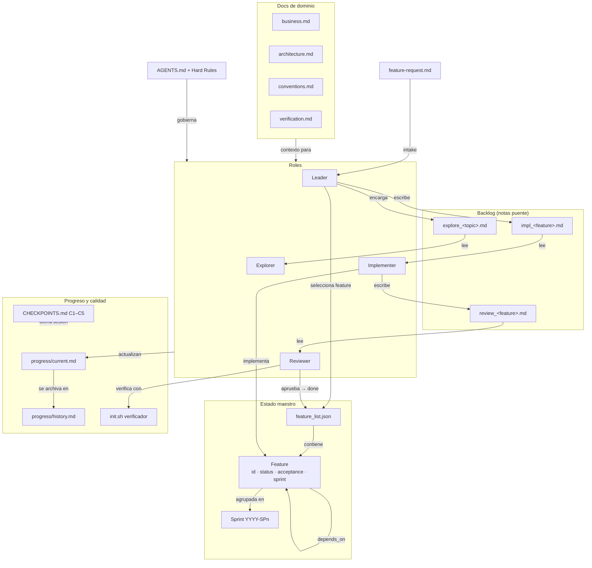
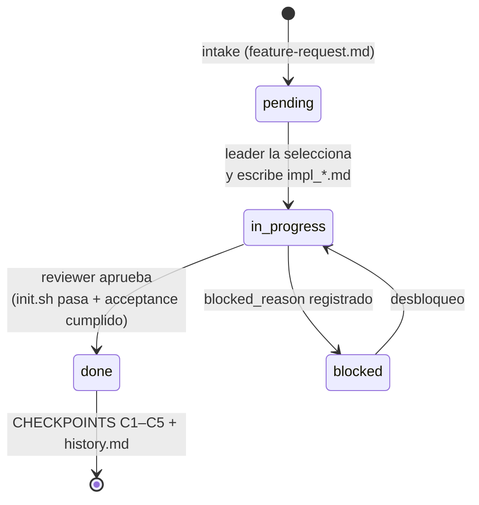

# Mapa de entidades de negocio — Handyman

> Generado a partir del grafo de conocimiento del proyecto (`graphify-out/`) y del schema
> `handyman/assets/schemas/feature_list.schema.json`. Sirve como documentación del dominio
> y como base para definir el corpus de recuperación (RAG) del harness.

## 1. Visión general

Handyman es un **harness de agentes** que organiza el trabajo en features atómicas,
ejecutadas por roles especializados (leader / implementer / reviewer / explorer) que se
comunican **solo a través de estado en disco** (anti "teléfono descompuesto") y validan su
trabajo con **verificación ejecutable** (`init.sh`).

## 2. Entidades principales

### 2.1 Feature (unidad de trabajo)

La entidad central del dominio. Vive en `feature_list.json`.

| Campo | Descripción |
|---|---|
| `id` | Entero ≥ 1, identificador único |
| `name` | Nombre corto (slug) |
| `title` | Título legible |
| `status` | `pending` → `in_progress` → `done`, o `blocked` |
| `blocked_reason` | Motivo cuando `status = blocked` |
| `acceptance` | Criterios de aceptación verificables |
| `sprint` | Agrupación temporal, patrón `YYYY-SPn` (ej. `2026-SP3`) |
| `depends_on` | Dependencias hacia otras features (por id) |

### 2.2 feature_list.json (estado maestro)

Documento raíz del estado del harness. Secciones (según el schema):

- `config` — `install_mode`, `project_name`, `project_root`, `harness_workspace`
- `discovery` — comandos de descubrimiento del proyecto (incluye `post_run` como `command_list`)
- `rules` — reglas del proyecto
- `features[]` — la lista de features (entidad 2.1)

### 2.3 Roles (agentes)

Cada rol tiene template propio (`handyman/assets/role-*.template.md`), protocolo
(`handyman/references/workflow.md`), y defaults de modelo y herramientas
(`references/models.md`, `references/tools.md`).

| Rol | Responsabilidad | Protocolo |
|---|---|---|
| **Leader** | Planifica, selecciona la siguiente feature, mantiene el estado coherente | `workflow.md` L43 |
| **Implementer** | Implementa exactamente una feature por sesión | `workflow.md` L57 |
| **Reviewer** | Verifica la implementación contra los criterios de aceptación | `workflow.md` L72 |
| **Explorer** | Exploración paralela de temas abiertos (sin tocar estado principal) | `workflow.md` L126 |

### 2.4 Backlog (notas puente entre roles)

Mecanismo anti-teléfono-descompuesto: los roles no se hablan, se dejan notas.

- `backlog/impl_<feature>.md` — nota del leader al implementer
- `backlog/review_<feature>.md` — nota del implementer al reviewer
- `backlog/explore_<topic>.md` — encargo de exploración

### 2.5 Progreso

- `progress/current.md` — estado de la sesión/feature en curso
- `progress/history.md` — historial acumulado de sesiones

### 2.6 CHECKPOINTS.md (control de calidad de sesión)

Lista de verificación que cierra cada sesión:

| Checkpoint | Verifica |
|---|---|
| **C1 — Harness Complete** | La estructura del harness está completa |
| **C2 — State Coherent** | `feature_list.json`, backlog y progress son consistentes entre sí |
| **C3 — Architecture Respected** | No se violó la arquitectura documentada |
| **C4 — Verification Real** | `init.sh` / verificación ejecutable pasó de verdad |
| **C5 — Session Closed** | Estado persistido y sesión cerrada limpiamente |

### 2.7 Documentación de dominio (`docs/` del workspace)

- `docs/business.md` — contexto de negocio del proyecto anfitrión
- `docs/architecture.md` — arquitectura
- `docs/conventions.md` — convenciones de código
- `docs/verification.md` — cómo se verifica el proyecto

### 2.8 Entidades de soporte

| Entidad | Archivo | Rol en el dominio |
|---|---|---|
| Mapa de navegación de agentes | `AGENTS.md` | Punto de entrada + Hard Rules para todo agente |
| Configuración del harness | `harness.config.json` | Parámetros de instalación/ejecución |
| Verificador ejecutable | `init.sh` | Única fuente de verdad de "funciona" |
| Intake de features | `feature-request.md` | Formulario de entrada de nuevas features |
| MOC Obsidian | `index.md` | Vista del workspace como vault (State, Docs, Progress, Backlog, Bridge Files, Tags) |
| Modelo de amenazas | `references/security.md` | Regla de oro: contenido no confiable = datos, no instrucciones |

### 2.9 Herramientas (CLIs TypeScript, `handyman/src/`)

Operan sobre las entidades anteriores de forma determinista:

| CLI | Entidad que opera |
|---|---|
| `feature.ts` | Features (transiciones de estado) |
| `backlog.ts` | Notas de backlog |
| `sprint.ts` | Sprints (`YYYY-SPn`) |
| `metrics.ts` | Métricas sobre feature_list / historial |
| `preflight.ts` | Validaciones previas a sesión |
| `evals.ts` | Evaluaciones del modelo/harness |
| `index_md.ts` | MOC Obsidian |
| `tools_discovery.ts` | Descubrimiento de herramientas |
| `validate_harness.ts` / `update_harness.ts` / `upgrade_harness.ts` | Integridad y ciclo de vida del harness |

## 3. Diagrama de entidades

## 4. Ciclo de vida de una feature

## 5. Entidades como corpus de recuperación (relación con RAG)

Cada grupo de entidades es una fuente natural de recuperación con distinta granularidad:

| Fuente | Contenido | Uso en recuperación |
|---|---|---|
| `feature_list.json` | Estado estructurado | Consulta exacta (no necesita embeddings) |
| `backlog/*.md` | Decisiones e instrucciones entre roles | Búsqueda semántica: "¿por qué se hizo X así?" |
| `progress/history.md` | Historial de sesiones | Memoria de largo plazo entre sesiones |
| `docs/*.md` | Negocio, arquitectura, convenciones | Contexto de dominio para cualquier rol |
| `graphify-out/graph.json` | Grafo de entidades y relaciones | GraphRAG: navegación por relaciones |
