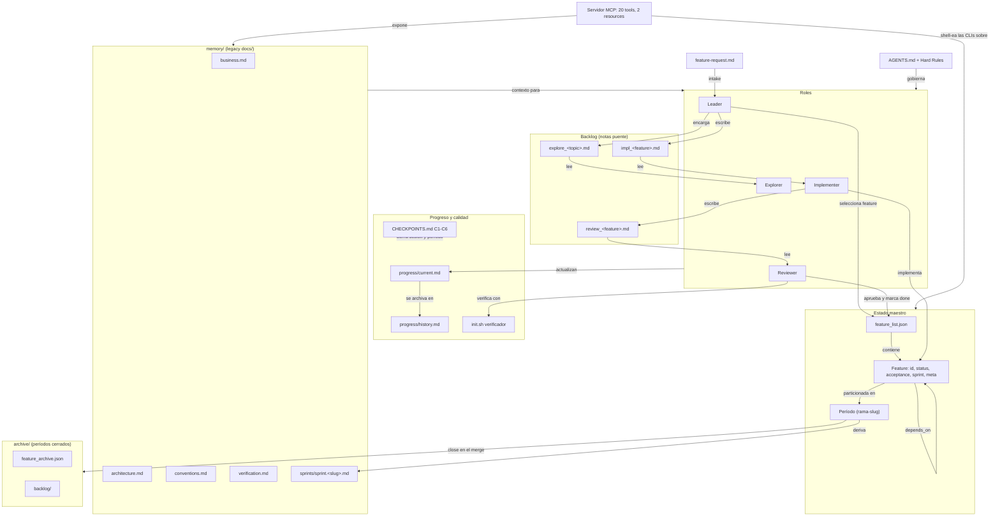
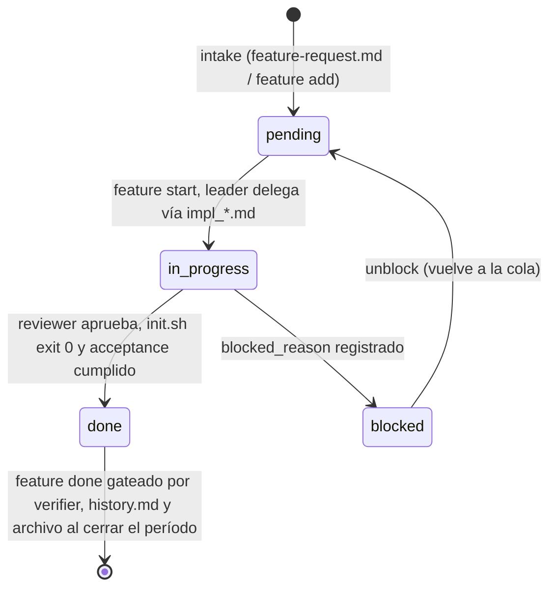

# Mapa de entidades de negocio — Handyman

> Generado a partir del grafo de conocimiento del proyecto (`graphify-out/`), del schema
> `handyman/assets/schemas/feature_list.schema.json` y de las fuentes del skill (`handyman/`).
> Sirve como documentación del dominio y como base para definir el corpus de recuperación (RAG) del harness.
>
> **Actualizado: 2026-07-24** — refleja el skill 3.6.0: layout `memory/`, la rama como
> período de trabajo, checkpoints C1–C6 y el servidor MCP multi-repo.

## 1. Visión general

Handyman es un **harness de agentes** que organiza el trabajo en features atómicas,
ejecutadas por roles especializados (leader / implementer / reviewer / explorer) que se
comunican **solo a través de estado en disco** (anti "teléfono descompuesto") y validan su
trabajo con **verificación ejecutable** (`init.sh`). El **período de trabajo es la rama**:
se abre al crearla (`sprint open <rama-slug>`) y se cierra en el merge (`sprint close`).
Todo el dominio es consumible además vía un **servidor MCP** multi-repo, cuyas tools
shell-ean las mismas CLIs que usan los roles (cero segunda fuente de verdad).

## 2. Entidades principales

### 2.1 Feature (unidad de trabajo)

La entidad central del dominio. Vive en `feature_list.json` (schema draft-07,
`additionalProperties: false`).

| Campo | Descripción |
|---|---|
| `id` | Entero ≥ 1, identificador único (requerido) |
| `name` | Nombre corto, slug (requerido) |
| `title` | Título legible |
| `description` | Contexto y alcance |
| `status` | `pending` → `in_progress` → `done`, o `blocked` (requerido) |
| `blocked_reason` | Motivo cuando `status = blocked` |
| `acceptance` | Criterios de aceptación observables y verificables |
| `sprint` | Etiqueta de partición del período: slug fs-safe (`feat-rework-tools`); **partición, no cronología** |
| `depends_on` | Dependencias hacia otras features (por id) |
| `meta` | Sellos exactos para métricas: `started_at` / `done_at` (ISO 8601; los estampa `feature.js start/done`) |

### 2.2 feature_list.json (estado maestro)

Documento raíz del estado del harness. Secciones (según el schema):

- `project` + `description` — identidad del proyecto.
- `config` — `install_mode` (`local`/`global`), `project_name`, `project_root`,
  `handyman_root`, `harness_workspace`, `harness_version` (sello semver),
  `current_sprint` (período abierto), `discovery`, `post_run`.
- `discovery` — skills, servidores MCP y agentes de los que el harness **depende declaradamente**
  (`skills[]`, `mcp[]`, `agents[]`).
- `post_run` — comandos que corren tras cerrar una feature (p. ej. regenerar `index.md`).
- `rules` — `one_feature_at_a_time`, `require_tests_to_close`, `valid_status`.
- `features[]` — la lista de features (entidad 2.1).

El bloque `config` es un **espejo** de `harness.config.json` (archivo puente canónico en la
raíz del repo); la resolución prefiere `harness.config.json`.

### 2.3 Roles (agentes)

Cada rol tiene template propio (`handyman/assets/role-*.template.md`), archivo de agente
materializado en la plataforma (`.github/agents/*.agent.md`), protocolo
(`handyman/references/workflow.md`), y modelo y herramientas por rol declarados en
`harness.config.json` (`models`, `tools`).

| Rol | Responsabilidad | Protocolo |
|---|---|---|
| **Leader** | Planifica, selecciona la siguiente feature, mantiene el estado coherente; nunca edita código de producto | `workflow.md` — Leader Protocol |
| **Implementer** | Implementa exactamente una feature por sesión, con tests que prueban la aceptación | `workflow.md` — Implementer Protocol |
| **Reviewer** | Verifica la implementación contra la aceptación y el verifier; nunca edita código | `workflow.md` — Reviewer Protocol |
| **Explorer** | Exploración paralela de temas abiertos (solo lectura, sin tocar estado principal) | `workflow.md` — Parallel Exploration |

### 2.4 Backlog (notas puente entre roles)

Mecanismo anti-teléfono-descompuesto: los roles no se hablan, se dejan notas con
frontmatter tipado (generadas con `backlog.js`, nunca sobrescritas).

- `backlog/impl_<feature>.md` — reporte del implementer (archivos tocados, evidencia de tests).
- `backlog/review_<feature>.md` — veredicto del reviewer (`approved` / `changes_requested`).
- `backlog/explore_<topic>.md` — hallazgos de exploración de solo lectura.

Al cerrar un período, los reportes de las features archivadas se mueven a
`archive/backlog/`; solo los `explore_` activos permanecen en `backlog/`.

### 2.5 Progreso

- `progress/current.md` — estado de la sesión/feature en curso (se resetea al cerrar).
- `progress/history.md` — historial append-only; al cerrar el período, las entradas de
  features archivadas se compactan a stubs de una línea.

### 2.6 Período de trabajo (la rama como unidad)

El período reemplaza al sprint calendario (`YYYY-SPn` quedó atrás):

- `sprint open <rama-slug>` — estampa la etiqueta `sprint` en las features del backlog y
  fija `current_sprint` (en `harness.config.json`, espejado en `feature_list.json`).
- `sprint close` — en el merge: deriva `memory/sprints/sprint.<rama-slug>.md`, archiva las
  features `done` en `archive/feature_archive.json`, compacta sus entradas de history,
  mueve sus reportes a `archive/backlog/` y limpia `current_sprint`.
- `sprint status` — reporta el período abierto y sus features.

### 2.7 CHECKPOINTS.md (control de calidad de sesión y de período)

Lista de verificación que cierra cada sesión (C1–C5) y cada período (C6):

| Checkpoint | Verifica |
|---|---|
| **C1 — Harness Complete** | La estructura del harness está completa y el verifier sale 0 |
| **C2 — State Coherent** | `feature_list.json`, backlog y progress son consistentes entre sí |
| **C3 — Architecture Respected** | No se violó la arquitectura documentada (`memory/architecture.md`) |
| **C4 — Verification Real** | `init.sh` / verificación ejecutable pasó de verdad, con tests > 0 |
| **C5 — Session Closed** | Estado persistido y sesión cerrada limpiamente |
| **C6 — Period Closed** | `sprint close` ejecutado antes del merge: archivo, history compactado, `current_sprint` limpio |

### 2.8 Documentación de dominio (`memory/` del workspace)

El directorio de conocimiento del workspace es `memory/` (legacy: `docs/` — los harnesses
antiguos siguen funcionando vía `resolveDocsDir`, que resuelve `memory/` primero):

- `memory/business.md` — contexto de negocio del proyecto anfitrión (se llena entrevistando al usuario).
- `memory/architecture.md` — arquitectura y límites del proyecto.
- `memory/conventions.md` — convenciones de código.
- `memory/verification.md` — cómo se verifica el proyecto.
- `memory/sprints/` — un documento derivado por período cerrado.

Superficies que **mantienen** el nombre `docs` a propósito: las URIs MCP
(`handyman://{project}/docs/{doc}`), el tag Obsidian `#handyman/docs` y los nombres de los
assets `docs-*.template.md` (prefijo histórico).

### 2.9 Entidades de soporte

| Entidad | Archivo | Rol en el dominio |
|---|---|---|
| Mapa de navegación de agentes | `AGENTS.md` | Punto de entrada + Hard Rules para todo agente |
| Configuración del harness | `harness.config.json` | Puente canónico: instalación, modelos/herramientas por rol, discovery, post_run |
| Verificador ejecutable | `init.sh` | Única fuente de verdad de "funciona" (gates: tools → files → state → lint → build → harness → test) |
| Intake de features | `feature-request.md` | Formulario de entrada de nuevas features |
| MOC Obsidian | `index.md` | Vista del workspace como vault (State, Docs, Progress, Features, Backlog, Tags) |
| Registro MCP | `.vscode/mcp.json` | Conecta el servidor MCP del harness al editor |
| Modelo de amenazas | `references/security.md` | Regla de oro: contenido no confiable = datos, no instrucciones |

### 2.10 Herramientas (CLIs TypeScript, `handyman/src/`)

Operan sobre las entidades anteriores de forma determinista:

| CLI | Entidad que opera |
|---|---|
| `feature.ts` | Features (transiciones atómicas: add/start/block/unblock/acceptance/done/ready/log/next) |
| `backlog.ts` | Notas de backlog (impl/review/explore) |
| `sprint.ts` | Períodos (open/close/status) |
| `metrics.ts` | Métricas sobre feature_list / historial |
| `preflight.ts` | Reporte de estabilidad read-only previo a sesión |
| `evals.ts` | Evaluaciones del modelo/harness |
| `index_md.ts` | MOC Obsidian |
| `tools_discovery.ts` | Descubrimiento y declaración de skills/MCP/agentes |
| `validate_harness.ts` / `update_harness.ts` / `upgrade_harness.ts` | Integridad y ciclo de vida del harness |
| `mcp.ts` | Servidor MCP (entidad 2.11) |
| `toolbox*.ts` + `packages/toolbox-core` | Observabilidad multi-repo (fleet) y core compartido (`resolveWorkspace`, `resolveDocsDir`) |

### 2.11 Servidor MCP (`handyman-mcp-server`)

Wrapper MCP stdio delgado sobre las mismas CLIs: el contrato vive en código, no en prosa.
Hub multi-repo — toda tool acepta `project` (nombre del registry, root absoluto o cwd);
las tools de registry leen `$HOME/HANDYMAN/registry.json`.

- **20 tools**: `harness_list`, `preflight`, `feature_next`, `feature_add`, `feature_start`,
  `feature_log`, `feature_next_step`, `feature_block`, `feature_unblock`,
  `feature_acceptance`, `backlog_review`, `feature_close`, `report_write`, `verify`,
  `sprint_status`, `upgrade_check`, `metrics`, `fleet_status`, `fleet_health`, `fleet_timeline`.
- **Invariantes como precondiciones de código**: `feature_close` delega en `feature.js done`,
  así un verifier rojo **rechaza el cierre** por precondición de subprocess, no por convención;
  `feature_start` enforcea un solo `in_progress`.
- **2 resources**: `handyman://{project}/current` (progress/current.md) y
  `handyman://{project}/docs/{doc}` (archivos del directorio de conocimiento, `memory/` vía
  `resolveDocsDir`).

## 3. Diagrama de entidades

## 4. Ciclo de vida de una feature

## 5. Entidades como corpus de recuperación (relación con RAG)

Cada grupo de entidades es una fuente natural de recuperación con distinta granularidad:

| Fuente | Contenido | Uso en recuperación |
|---|---|---|
| `feature_list.json` | Estado estructurado | Consulta exacta (no necesita embeddings) |
| `backlog/*.md` | Decisiones e instrucciones entre roles | Búsqueda semántica: "¿por qué se hizo X así?" |
| `progress/history.md` | Historial de sesiones | Memoria de largo plazo entre sesiones |
| `memory/*.md` | Negocio, arquitectura, convenciones, verificación | Contexto de dominio para cualquier rol |
| `memory/sprints/*.md` | Narrativa derivada por período cerrado | Resumen ejecutivo de cada rama mergeada |
| `archive/` | Features y reportes de períodos cerrados | Trazabilidad histórica completa |
| `graphify-out/graph.json` | Grafo de entidades y relaciones | GraphRAG: navegación por relaciones |
